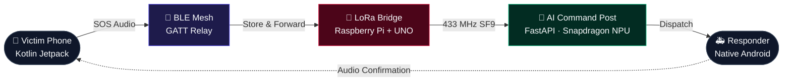

<div align="center">

# Sankat-Mochan

**Autonomous Off-Grid Disaster Rescue Mesh | Snapdragon Multiverse Hackathon National Finalist**

Distributed offline SOS orchestration, real-time edge AI triage, and mesh network communication across smartphones, LoRa bridges, and Snapdragon NPU execution planes.

[](#)
[](#)
[](#)
[](#)

</div>

---

## Overview

When floods, earthquakes, or blackouts knock out cell towers and the internet, communication is severed when it's needed most. **Sankat-Mochan** is a highly resilient, offline mesh network where smartphones and localized IoT nodes autonomously form an independent radio network to coordinate disaster rescue.

<div align="center">
  
  <br>
  <em>Victim SOS travels via BLE mesh, shot across LoRa bridge to Command Post for NPU AI Triage.</em>
</div>

### Key Features

- 📱 **Voice-First SOS** — Direct on-device speech-to-text using IndicConformer
- 🐜 **BLE Mesh Transport** — Smartphone-to-smartphone ad-hoc store-and-forward networking
- 🚀 **LoRa Hardware Bridge** — Kilometer-scale range extension via Arduino and Raspberry Pi
- 🧠 **NPU AI Triage** — Offline LLM (Sahayak-E2B) running natively on Snapdragon Hexagon NPUs
- 🗺️ **Offline Dispatch** — Live ops dashboard (MapLibre GL) executing completely without internet access
- 🗣️ **Cross-Language Translation** — Multi-lingual SOS extraction converting native Indian languages to English

---

## Architecture



### Component Summary

| Component | Technology | Role |
|-----------|-----------|------|
| **Android Mesh App** | Kotlin, Jetpack Compose, BLE | T0 transport slice forming the GATT mesh (Victim, Responder, Relay) |
| **LoRa Gateway** | Python, Raspberry Pi | Bridging phone ⇄ BLE ⇄ LoRa ⇄ mesh serving as the command post uplink |
| **Field Node Modem** | C++, Arduino UNO Q | Field-side LoRa modem logic to drive the Ra-02 transceiver |
| **AI Command Post** | FastAPI, React, MapLibre GL | Offline backend receiving envelopes, executing NLP triage/translation |
| **Edge AI Finetuning** | PyTorch, Unsloth, QLoRA | Hardware-agnostic pipeline used to train the Sahayak-E2B edge models |

### Data Flow

1. **Submit** → Victim speaks an SOS. Phone compresses and transcribes it on-device using IndicConformer.
2. **Transport** → Message relays phone-to-phone via BLE GATT. For long distance, the LoRa bridge spans the gap.
3. **Triage** → The AI Command Post processes the envelope via Gemma 4 E2B on the Snapdragon NPU.
4. **Dispatch** → The dispatcher assigns the nearest responder using the offline map.
5. **Acknowledge** → Responder taps accept, sending a native-language audio confirmation back down the chain to the victim.

---

## 🧠 Sahayak-E2B: Open-Source Models

We engineered and released custom fine-tuned weights tailored for robust conversational SOS extraction on edge hardware. 

* **[Sahayak-E2B (Base Gemma 4 E2B Fine-tune)](https://huggingface.co/kesav2k04/sahayak-e2b):** Optimized for low-latency native English/Indic language extraction.
* **[Sahayak-E2B GGUF (Quantized for NPUs)](https://huggingface.co/kesav2k04/sahayak-e2b-gguf):** Merged and quantized (`q4_k_m`) for direct injection into Snapdragon NPU architectures via the `llama.cpp` runtime, guaranteeing 100% offline inference.

---

## Project Structure

```
Sankat-Mochan/
├── mesh-app/                    # Android BLE mesh app (Kotlin)
├── pi-code/                     # LoRa gateway bridge (Python)
├── arduino-unoq/                # Field node modem (C++)
├── command-post/                # Offline AI backend (FastAPI)
├── finetune/                    # Hardware-agnostic QLoRA pipeline
├── deck/                        # HTML presentation deck
└── docs/                        # Architecture diagrams & references
```

---

## Quick Start

### 1. Run the Mesh Application

The core Android application requires Android Studio and the Android SDK.

```bash
cd mesh-app
./gradlew assembleDebug 
```
*Note: The application must be installed on **two or more physical Android devices** (emulators do not support the required BLE peripheral/central features).*

### 2. View the Pitch Deck

The pitch deck is completely self-contained. Open it directly in any modern browser:

```bash
open deck/index.html 
```

---

## 👥 The Team

* **Krishna** - *Team Lead & Architect*
* **Isha** - *AI Research & Integration*
* **Karthi** - *Mobile Mesh Engineering*
* **Keshav** - *AI Infrastructure*
* **Siva** - *Hardware & LoRa Bridging*

---

## 📄 License

This project is open-sourced under the **[MIT License](LICENSE)** in accordance with hackathon regulations.
