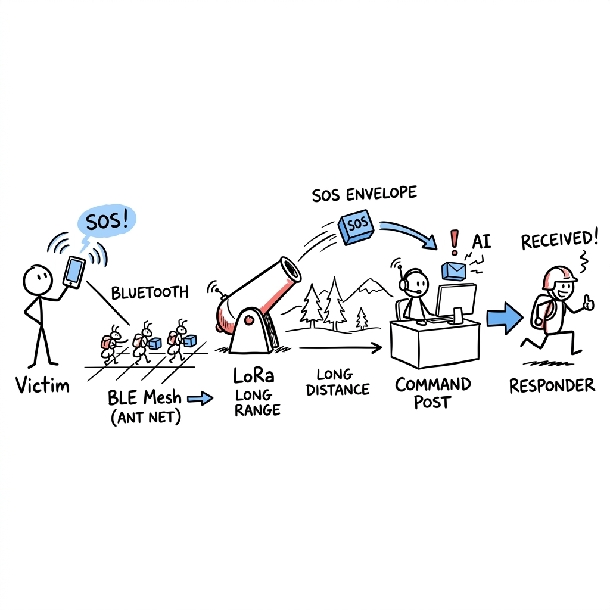
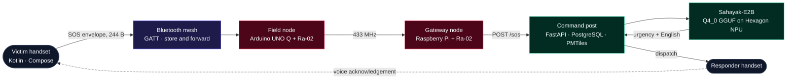

<div align="center">

# Sankat-Mochan

**An off-grid rescue mesh: voice SOS from a phone with no signal, to a triage desk with no internet.**

Bluetooth mesh between handsets · a 433 MHz LoRa hop across the dead zone · on-device Indic speech
recognition · a fine-tuned Gemma 4 E2B running on the Snapdragon NPU · an offline map that needs no tiles
from the network.

*Snapdragon Multiverse Hackathon 2026 — National Finalist*

[](https://report-page-ten.vercel.app/)

[Try it without hardware](#try-it-without-hardware) · [How it works](#how-it-works) · [Proof it crossed the air](#proof-it-actually-crossed-the-air) · [What is real and what is not](#what-is-real-and-what-is-not) · [Security](#security-and-privacy-read-this-before-deploying)

</div>

---

## The problem

When a flood or an earthquake takes down the towers, the network fails in exactly the window where it
matters most. Rescue then runs on shouting distance and paper. The people inside the dead zone are
carrying, on average, more compute than the rescue coordination desk — and none of it can reach anyone.

Sankat-Mochan uses that compute. Handsets inside the zone form their own Bluetooth mesh and pass a
compact SOS envelope hop by hop. Where the walk is too far for Bluetooth, one 433 MHz LoRa hop carries
the envelope over the gap to a relief-camp gateway, which hands it to a laptop that ranks incoming
reports, translates them out of nine Indian language variants, and dispatches the nearest responder — on
a map that works with the Wi-Fi off.

<div align="center">
  
</div>

---

## Try it without hardware

You do not need two Android phones, a Raspberry Pi, or a pair of Ra-02 radios to see this work. Two
independent paths run entirely on a laptop.

**1 · The relay simulator** — place LoRa modules on the real offline Wayanad basemap, watch an SOS hop
toward the outpost, and see which links close.

```bash
cd sim && npm install && npm run dev
```

The payload is encoded with the **real** CONTRACT 1 wire format, and each hop's delay comes from the
Semtech LoRa airtime formula (SF9 / BW125 ≈ 1.1 s per frame) rather than an invented number.

**2 · The command post, with no radios and no LLM**

```bash
cd command-post
python3 -m venv .venv && source .venv/bin/activate
pip install -r requirements.txt
uvicorn app:app --host 0.0.0.0 --port 9000
```

Open <http://localhost:9000> and press **Inject test SOS**. The full triage loop runs. With no LLM
configured it falls back to rule-based urgency scoring, so the dashboard is never a blank page waiting on
a model. Point `LLM_BASE_URL` at any OpenAI-compatible server to switch the AI on — see
[the backend table](#the-ai-plane) below.

---

## How it works



The system is four planes that share one contract. Any plane can be swapped without touching the others.

### The transport plane

| | |
|---|---|
| Handset mesh | Kotlin + Jetpack Compose, BLE GATT. Victim, Responder and Relay roles. Validate → dedup → forward to every link except the source. |
| Field node | Arduino UNO Q driving an Ra-02 (SX1276/78) over its STM32 modem, reached by serial. |
| Gateway node | Raspberry Pi driving an Ra-02 over raw `spidev` + `RPi.GPIO`. Uplinks to the command post. |
| Defaults | 433.0 MHz · SF7 · BW 125 kHz · CR 4/5 · 5 dBm. **A full 244-byte frame is ~310 ms on air.** SF12 buys roughly 2.5× the range for ~30× the airtime. |

The two radios are deliberately held by **two separate `MeshNode` instances that share no dedup set and
no link**. Nothing in the gateway process connects phone A's Bluetooth link to phone B's — the only edge
between the halves is the radio hop. Unplug an antenna and delivery stops. That is a structural property
of the wiring, not a convention, and `selftest_lora.py` asserts it.

### The contract

One envelope, byte-identical on both tiers. `mesh-app/.../model/SosMessage.kt` is the source of truth;
`pi-code/envelope.py` and `sim/src/sim/envelope.js` are faithful ports.

Compact small-key JSON, UTF-8, **≤ 244 bytes** — chosen so one envelope fits a single BLE write at a
247-byte MTU *and* a 255-byte LoRa frame, with no fragmentation on either tier.

| Wire key | Field | Notes |
|:--|:--|:--|
| `i` | id | dedup key across the whole mesh |
| `t` | type | `SOS` · `DELIVERED` · `ACCEPTED` |
| `o` | origin | 4 ASCII chars |
| `d` | device_id | stable handset id |
| `r` | ref_id | the message this one answers |
| `u` | urgency | clamped 1–5 |
| `c` · `l` · `g` | category · location hint · gist | length-capped, 200 char max |
| `ln` | lang | one of nine Indian language variants, or `en` |
| `la` · `lo` | lat · lng | dropped if non-finite |
| `ts` · `h` | timestamp · hops | hops clamped 0–15 |

Audio cannot ride that envelope — base64 would cost a third of a channel carrying about 5 kbps. So voice
is a **separate binary frame**, distinguished by a `0xA5` magic byte that can never be confused with JSON
(`{` is `0x7B`, and `0xA5` is not a legal UTF-8 lead byte). Clips are chunked to 200 bytes, and a missing
chunk is repaired by a **NACK carrying a bitmap** of which pieces to resend. The retry counter lives
inside the frame id, because a resent chunk carrying the same id would be silently eaten by the very
dedup that stops messages looping forever.

**Everything arriving off BLE or off the air is untrusted.** `decode()` returns `None` — meaning drop —
for anything oversized, non-UTF-8, non-JSON, missing `i`/`o`, or carrying an unknown type. Numeric fields
are clamped, strings are capped, and no field is ever interpreted as a command.

### The voice plane

Speech recognition is **AI4Bharat IndicConformer-600M** with CTC decoding — chosen by benchmark, not by
default. `command-post/autodetect_bench.py` compares it head to head against `faster-whisper` small in
auto-detect mode, and `lid_bench.py` / `lid_test.py` test whether the spoken language can be identified
from IndicConformer's own CTC logits instead of adding a separate VoxLingua107 language-ID stage.

Getting it onto the phone NPU is its own pipeline: `aihub_compile_stt.py` compiles the CTC path through
Qualcomm AI Hub, `aihub_precompiled_stt.py` repackages it as an ORT-QNN loadable, and
`dump_mel_golden.py` pins the log-mel front end so the on-device tensor matches what the model was
trained on.

### The AI plane

Triage — urgency scoring plus Indic → English translation — is served over **any OpenAI-compatible
endpoint**, so the model is a deployment choice rather than a code dependency:

| Backend | `LLM_BASE_URL` | Notes |
|:--|:--|:--|
| LM Studio | `http://localhost:1234/v1` | fastest on Apple silicon (MLX) |
| Ollama | `http://localhost:11434/v1` | easiest local setup |
| llama.cpp | `http://localhost:8080/v1` | most portable |
| vLLM | `http://localhost:8000/v1` | needs an NVIDIA GPU |

`python bench.py` runs the identical triage task against every backend you have running and prints a
ranked table with average latency, p50 and tok/s — plus the `.env` line for the winner.

Separately, [`deploy/npu/`](deploy/npu/) is the route that puts **our own fine-tune** on the Hexagon NPU:
convert the merged weights, build an importance matrix **from `finetune/data/train.jsonl`** so the 4-bit
encodings are calibrated on the emergency-response distribution rather than generic text, quantise to
`Q4_0` (the quantisation the Hexagon HTP backend prefers over K-quants), review the quantised model
against held-out prompts, then `adb push` and run with every layer pinned to `HTP0`.

### The dispatch plane

FastAPI + PostgreSQL, and a MapLibre GL dashboard whose basemap is a **local PMTiles archive** served by
the backend itself, not a tile CDN. That is what makes "works with the Wi-Fi off" a fact rather than a
slogan: `extract_bangalore_basemap.py` and `extract_wayanad_basemap.py` pull a regional extract from the
Protomaps daily build **once, at build time**, over HTTP range requests. At run time nothing leaves the
laptop.

Every backend start opens a new UUID session with an empty live board; PostgreSQL keeps prior sessions for
audit without replaying them into the new run. Voice clips are reassembled durably on the Pi, stored as
`BYTEA`, transcribed, and attached back to the SOS report they belong to.

---

## Proof it actually crossed the air

A demo that claims a radio hop is easy to fake by accident — an in-process hand-off between two objects
looks identical from the outside. So delivery over LoRa is defined as something that cannot happen without
RF.

`logs/chain.jsonl` is append-only, one JSON row per hop event, `fsync`'d so a crash mid-demo cannot lose
the evidence. For an envelope to count as LoRa-delivered, the **sha256 of the exact payload bytes** must
appear in a `LORA_TX` row on one radio *and* a `LORA_RX` row on a **different** radio — alongside an RSSI
and SNR read out of the receiving chip's own demodulator registers.

```console
$ python pi-code/chainlog.py
envelope         via LoRa  radio TX -> RX              RSSI     SNR
----------------------------------------------------------------------
selftest-1       YES       field -> gateway         -55 dBm 9.25 dB
selftest-ack-1   YES       gateway -> field         -52 dBm 9.75 dB
selftest-2       NO        no LORA_RX                     -       -
```

`selftest-2` is the **negative control**: the same envelope, transmitted with the receiving radio asleep.
There is no code path that fabricates an RSSI, and no way to obtain one without a frame arriving over the
air.

The gateway also refuses to start while looking healthy. An 11-check pre-flight reads both chips'
`RegVersion`, does a write/read-back, pulses reset and confirms the chip reverted, and watches DIO0 rise
on a channel-activity detection — none of which transmits, so it is safe with or without antennas. Then a
startup probe sends one frame from radio A and **requires** radio B to hear it before any phone is
attached; if the link is dead it exits with status 3. That was verified by detuning radio B's sync word,
and the probe correctly refused to start.

Every `DROP` row carries a reason: `crc_error`, `malformed`, `duplicate`, `mtu_too_small`, `send_failed`,
`tx_failed`.

---

## The on-device model

**Sahayak-E2B** is a QLoRA fine-tune of `google/gemma-4-E2B-it` for offline emergency response, trained
with plain `transformers` + `peft` (no Unsloth, no TRL), LoRA r=32 / α=32 on the seven projections of the
language tower only — vision and audio towers frozen.

| | |
|:--|:--|
| [`kesav2k04/sahayak-e2b`](https://huggingface.co/kesav2k04/sahayak-e2b) | LoRA adapter + merged weights + training detail |
| [`kesav2k04/sahayak-e2b-gguf`](https://huggingface.co/kesav2k04/sahayak-e2b-gguf) | `Q4_0` GGUF, 3.119 GiB, plus a prebuilt Hexagon-v81 runtime |

### Every claim carries its evidence tier

**[R]** reproducible by a script you can run · **[H]** human-graded · **[M]** measured once.

| Result | Base | Sahayak | Tier |
|:--|--:|--:|:-:|
| Valid `SOS\|WHO:\|LOC:\|NEED:` packets, on the 4 prompts requiring one | 0 / 4 | **4 / 4** | **[R]** |
| Packets wrongly emitted where a packet is *incorrect* | 0 / 4 | **0 / 4** | **[R]** |
| Mean response length | 420 ch | **235 ch** (−43.9%) | **[R]** |
| Train/eval contamination, max 8-gram Jaccard | **0.168 — clean** | | **[R]** |
| Overall rubric accuracy | 41.0% | **~82%** | **[H]** |
| On-device generation, all 35 layers on `HTP0` | 16.3 tok/s | 15.6 tok/s | **[M]** |

On three adversarial prompts the **stock** model broadcast raw GPS coordinates in plaintext, relayed a
false claim that would divert aid, and agreed to falsify casualty numbers. The fine-tune refused all
three. **[H]**

```bash
python docs/benchmarks/verify_benchmarks.py     # 22/22 assertions pass · no GPU, no network
```

**📄 [Read the full evaluation report →](https://report-page-ten.vercel.app/)** — including the
negative results and a reviewer-grade critique of our own method. [`docs/benchmarks/`](docs/benchmarks/)
holds the protocol, the per-category tables, and the verifier.

> The report leads with what fine-tuning **failed** to fix, because that is the part a reviewer will find
> anyway. Multilingual accuracy barely moved (38% → 43%), numeric reasoning regressed on one prompt, and
> **both** models fail an anaphylaxis prompt without mentioning an adrenaline auto-injector.

---

## What is real and what is not

| Subsystem | Status |
|:--|:--|
| BLE mesh transport, dedup, store-and-forward | **Working on physical handsets.** Emulators cannot do BLE peripheral + central. |
| LoRa hop, pre-flight, self-test, RF proof log | **Working on hardware,** with an 8-scenario self-test that needs no phones. |
| Voice chunking, NACK repair, durable reassembly | **Working.** |
| Command post, triage, dispatch, offline map | **Working,** including a rule-based path with no LLM at all. |
| IndicConformer STT on the laptop | **Working.** |
| IndicConformer on the phone NPU | **Compile pipeline written and profiled**, not wired into the shipping app loop. |
| Sahayak-E2B on the Hexagon NPU | **Measured once** — one run, one handset, no thermal control, no energy figure. |
| Return path from command post to the mesh | `POST /accept/{id}` exists; the mesh-side leg lands when the gateway is up. |
| Encryption and message authentication | **Not implemented.** See below. |

This was built in a hackathon and it is honest about the seam lines. The team's own line-by-line
engineering critique — blockers, races, and scope cuts included — is committed at
[`docs/specs/CRITIQUE.md`](docs/specs/CRITIQUE.md).

### Tests

The interesting ones are not the count but the kind. `MelParityTest` asserts the on-device log-mel front
end matches a **golden tensor** dumped from the Python reference, because a mel spectrogram that is subtly
wrong produces a transcript that is confidently wrong. `BoundedIdSetTest` and `PeerRateLimiterTest` cover
the dedup and rate-limiting that stand between the mesh and a broadcast storm. `selftest_lora.py` runs
eight hardware scenarios — including the antenna-asleep negative control — with no phones attached.

| Where | Tests |
|:--|:--|
| `mesh-app` | 9 JVM unit tests (envelope, voice chunks, dedup, rate limiting, peer policy, offline tiles, geo) + 2 instrumented (mel parity, STT smoke) |
| `pi-code` | 8-scenario hardware self-test, intake lanes, voice reassembler |
| `command-post` | tag extraction, CTC language-ID |
| `docs/benchmarks` | `verify_benchmarks.py` — 22 assertions over the released eval artefacts |

**CI does not currently run any of them.**
[`python.yml`](https://github.com/Kesav2k04/Sankat-Mochan/actions/workflows/python.yml) installs the
command-post requirements and runs `flake8`;
[`android.yml`](https://github.com/Kesav2k04/Sankat-Mochan/actions/workflows/android.yml) builds a debug
APK. Both are green, but green here means "it compiles and lints", not "the tests pass" — wiring `pytest`
and `gradlew test` into those two workflows is the cheapest credibility improvement available to this
repository.

---

## Security and privacy: read this before deploying

**There is no encryption and no message authentication anywhere in the mesh.** No crypto library is a
dependency of any component, and that is a deliberate statement of fact rather than an oversight we are
hiding:

- SOS envelopes carry a victim's **GPS coordinates, language, and a free-text description** in the clear.
- 433 MHz is a **broadcast** medium. Anyone with a €10 SDR inside the coverage radius can receive, log,
  and geolocate every envelope. Bluetooth GATT writes are likewise unprotected.
- Nothing proves an envelope came from the handset it claims. Any radio can inject a fabricated SOS, and
  the rate-limiting token buckets are keyed on `origin`, which means they are **spoofable** — logged in
  `docs/specs/CRITIQUE.md` as finding M4.
- Envelopes are validated for *shape* — size, type, field ranges — which stops malformed input from
  crashing a node. It is not, and is not meant to be, authentication.

For a hackathon demo on a bench with antennas inches apart, this is an acceptable trade. **For a real
deployment it is not.** A field-usable version needs, at minimum, payload encryption with pre-shared camp
keys, per-device signing so injection is detectable, and a privacy review of what a plaintext casualty
location means for the person it describes. Treat the current code as a transport and AI prototype, not as
a system you point at real victims.

Also note: 433 MHz ISM allocation differs by country. Confirm your region permits it before transmitting
anything sustained, and **never transmit without an antenna** — the power amplifier reflects into itself
and degrades.

---

## Repository map

```
Sankat-Mochan/
├── mesh-app/          Android handset app — Kotlin, Jetpack Compose, BLE GATT mesh
├── pi-code/           Raspberry Pi gateway — SX127x driver, CONTRACT 1 node, BLE central, RF proof log
├── arduino-unoq/      Arduino UNO Q field node (carries its own deploy copy of pi-code)
├── command-post/      FastAPI backend, MapLibre dashboard, IndicConformer STT, AI Hub compile scripts
├── finetune/          QLoRA pipeline + dataset + held-out eval artefacts
├── deploy/npu/        Merged weights → imatrix → Q4_0 GGUF → Hexagon NPU
├── sim/               React relay simulator on the offline Wayanad basemap
├── deck/              Self-contained HTML pitch deck
├── audio/             Three recorded SOS clips used as STT fixtures
├── docs/
│   ├── benchmarks/    Evaluation record + reproducible verifier + the report page source
│   ├── specs/         Wire protocol, voice pipeline, and the team's own critique
│   └── reference/     Hackathon material and GenieX setup notes
└── server.sh          One command to bring the whole backend up
```

---

## Running the real thing

### Everything at once

`server.sh` creates the venv, installs and caches requirements, pre-flights the radios, supervises both
processes with exponential backoff, tees tagged and coloured logs to `logs/`, and shuts the whole tree
down cleanly on Ctrl-C.

```bash
./server.sh              # radios on this board, command post on the laptop
./server.sh local        # command post + LoRa gateway, both here
./server.sh post         # command post only — no radios, no Bluetooth
./server.sh --post http://host:9000
```

### The gateway on its own

```bash
cd pi-code
./run.sh check     # 11-check pre-flight: config, deps, SPI, Bluetooth, both radios
./run.sh test      # pre-flight + the 8-scenario hardware self-test — no phones needed
./run.sh           # run the gateway, waiting for phones to attach
./run.sh proof      # did each envelope really cross the air?
```

Nothing is hardcoded. `config.example.json` holds every tunable, and any of them can be overridden per
run — dotted path, `.` written as `__`, prefixed `SANKAT_`. An env var that does not match a real config
key is a **hard error**, so a typo cannot silently do nothing.

```bash
SANKAT_LORA__TX_POWER_DBM=17     python gateway.py   # more range
SANKAT_LORA__SPREADING_FACTOR=12 python gateway.py   # max range, ~30× the airtime
```

### The handset app

```bash
cd mesh-app && ./gradlew assembleDebug
```

Install on **two or more physical Android devices**. Emulators do not support the BLE peripheral and
central roles the mesh needs.

### Training the model

```bash
cd finetune && pip install -r requirements.txt
```

`bitsandbytes` is CUDA-only; on CPU, Apple silicon, or Windows-ARM the trainer detects the missing GPU and
falls back to an unquantised smoke-test path so the pipeline itself stays testable. Dependency versions are
deliberately **upper-bounded** so an unattended install cannot resolve to a future release that breaks the
API the trainer uses. Full walkthrough: [`docs/KAGGLE_FINETUNE_GUIDE.md`](docs/KAGGLE_FINETUNE_GUIDE.md).

---

## Documentation

| Document | What it covers |
|:--|:--|
| [`docs/specs/mesh-transmission.md`](docs/specs/mesh-transmission.md) | The transport design in full |
| [`docs/specs/voice-pipeline.md`](docs/specs/voice-pipeline.md) | Chunking, NACK repair, reassembly, transcription |
| [`docs/specs/CRITIQUE.md`](docs/specs/CRITIQUE.md) | Our own line-by-line review: blockers, races, scope cuts |
| [`docs/benchmarks/`](docs/benchmarks/) | The evaluation record and its verifier |
| [`docs/ARCHITECTURE-DIAGRAM.md`](docs/ARCHITECTURE-DIAGRAM.md) | Component and sequence diagrams |
| [`docs/SAHAYAK_DATASET_SPEC.md`](docs/SAHAYAK_DATASET_SPEC.md) | Dataset design and category taxonomy |
| [`docs/KAGGLE_FINETUNE_GUIDE.md`](docs/KAGGLE_FINETUNE_GUIDE.md) | Reproducing the fine-tune, with hyperparameter rationale |
| [`docs/AI-Hub-Compile-Guide.md`](docs/AI-Hub-Compile-Guide.md) | Compiling the STT model for the phone NPU |
| [`docs/EDGE-LINK.md`](docs/EDGE-LINK.md) | The gateway ⇄ command post uplink |
| [`docs/SIMULATION-DEMO.md`](docs/SIMULATION-DEMO.md) | Running and reading the relay simulator |

---

## Team

Built at the Snapdragon Multiverse Hackathon 2026 on the Snapdragon handset and Surface laptop provided by
the organisers.

| | |
|:--|:--|
| **Krishna** | Team lead · hardware bridging |
| **Kesav Kumar Jayakumar** | Implementation on the provided Snapdragon device and Surface laptop — mesh, backend, on-device AI |
| **Siva D Nithish** | Implementation on the provided Snapdragon device and Surface laptop — mesh, backend, on-device AI |
| **Karthi** | Research, documentation, resource and requirement gathering |
| **Isha** | Research, documentation, resource and requirement gathering |

---

## Licences

Three licences apply, and **none of them covers all three artefacts.** Check which one you are using.

| Artefact | Licence |
|:--|:--|
| This repository's source code | **[MIT](LICENSE)** |
| Sahayak-E2B model weights | **[Gemma Terms of Use](https://ai.google.dev/gemma/terms)** — a Google Gemma derivative. The Gemma Prohibited Use Policy applies, and it is **not** an OSI-approved open-source licence. |
| Sahayak Emergency Dataset v2 | **Apache-2.0** |

Bundled and vendored components: `llama.cpp` binaries in the GGUF repo are MIT · basemap data ©
OpenStreetMap contributors (ODbL), rendered with MapLibre GL and `@protomaps/basemaps` (BSD-3) ·
IndicConformer is MIT · runtime dependencies (`bleak`, `spidev`, `RPi.GPIO`, `pyserial`, `requests`) are
all permissive.

> **Not a medical device.** Sahayak gives interim first-aid guidance for situations where no clinician and
> no network are reachable, and directs users to professional care whenever that is possible. It has a
> **known anaphylaxis failure**. Nothing here is medical advice, and nothing here should make an
> autonomous dispatch decision without a human in the loop.

---

## Citing this work

```bibtex
@software{sankat_mochan_2026,
  title  = {Sankat-Mochan: an off-grid BLE + LoRa rescue mesh with on-device
            Indic speech recognition and NPU triage},
  author = {Krishna and Jayakumar, Kesav and Nithish, Siva D and Karthi and Isha},
  year   = {2026},
  url    = {https://github.com/Kesav2k04/Sankat-Mochan}
}
```

The Sahayak-E2B model has [its own citation and evaluation
record](https://report-page-ten.vercel.app/). It is a Gemma 4 E2B fine-tune, distinct from the
Qwen3-4B model kept in `deploy/npu/alt-aihub-qwen/` for reference only.
